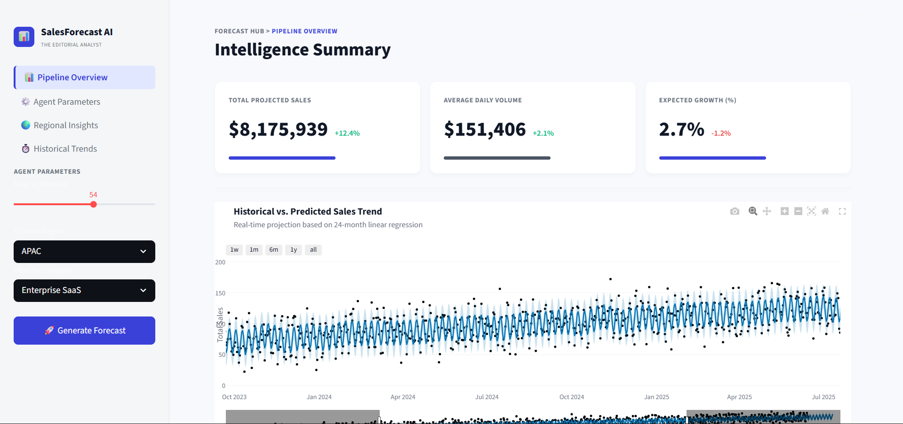
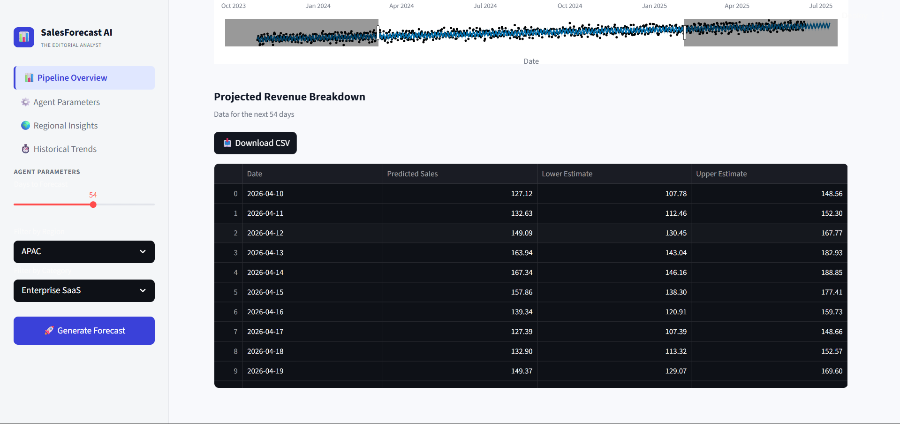

# 📊 SalesForecast AI

SalesForecast AI is an intelligent data-driven solution designed to predict and visualize business sales trends. Using advanced machine learning time-series models (**Facebook Prophet**) wrapped in a modern, dynamic **Streamlit** user interface, this agent operates like a virtual "Editorial Analyst." It extrapolates complex patterns extending beyond the historical baseline to provide a granular, interactive view of your pipeline overview, historical trends, and expected financial growth.

---

## 📸 Application Previews

**1. Intelligence Summary Dashboard & Metric Forecasting**


**2. Projected Revenue Breakdown & Data Export**


---

## 🧠 What This Project Does

SalesForecast AI is designed to act as an automated "Analyst in the Loop" for business revenue projections. At its core, the application ingests raw historical sales data, smooths out volatility, and algorithmically projects the trajectory of future sales volume. It empowers business leaders, marketing directors, and stakeholders to:
1. **Anticipate Revenue Flow:** Accurately gauge sales estimates by projecting 7 to 90+ days securely into the future based on past trend momentum.
2. **Review Historical Context:** Juxtapose expected statistical projections flawlessly onto past performance to calculate organic growth logic.
3. **Analyze Granular Metrics:** Immediately review top-level pseudo-KPIs (Total Projected Sales, Average Daily Volume, Expected Growth Percentage) to make informed, data-backed decisions across specified geographic regions or product classes.

---

## ⚙️ How It's Implemented

The architecture of this project fuses the rapid iteration of modern Python web frameworks with enterprise-grade mathematical modeling:

1. **Time-Series Engine (Prophet):** 
   - We utilize Meta's open-source `prophet` machine learning library. The underlying engine models the sales data as an additive time-series regression. It naturally digests non-linear trends, incorporates weekly and yearly seasonality coefficients automatically, and isolates outliers smoothly.
   - The primary function `train_and_forecast(df, future_days)` dynamically rebuilds and retrofits the model in real-time each instance the user adjusts constraints through the frontend.

2. **Presentation Layer (Streamlit & Custom UI):** 
   - A highly customized **Streamlit** Python dashboard acts as the interactive frontend. 
   - To achieve a premium "SaaS" (Software as a Service) fidelity, we forcefully override Streamlit's native theme. The UI actively injects uniquely tailored HTML/CSS blocks to introduce soft drop-shadows, the premium `Inter` font, meticulously spaced metric flexbox cards, and structured sidebar layouts spanning seamlessly across wide layouts.
   
3. **Data Visualization (Plotly):** 
   - The interactive chart rendering is deferred to natively integrated **Plotly Graph Objects**. Plot interactions (hover, zoom, pan) run natively for the end-user.
   - We enforce strict color parameters assuring visual accessibility. The graph programmatically disables overriding browser display states (light/dark mode clashing), forcefully rendering heavily contrasting dark-gray fonts (`#111827`) against a pristine white plotting canvas to match the interface mockups.

4. **Data Operations & State Preservation:** 
   - During the development proof-of-concept phase, the `load_data()` handler leverages `numpy` random distributions overlapping mathematical sine waves to statistically mimic roughly 24-months of real-world historical sales volatility.
   - Post-analysis components serialize the predictive timeframes back into a clean Pandas DataFrame. This data constructs a perfectly unified native-table display element mapped directly to a local, session-cached `st.download_button` so users can extract findings easily.

---

## ✨ Key Features
- **Predictive Engine:** Leverages the robust `Prophet` framework to detect yearly and weekly seasonalities and process robust forward-looking analytics.
- **SaaS Aesthetic Dashboard:** A natively styled analytical Streamlit dashboard engineered with high-end, responsive custom CSS, metric cards, and drop indicators. 
- **Interactive Visualizations:** Employs `Plotly` to orchestrate smooth, completely interactive web-ready charting equipped with zoom functions and hover tooltips.
- **Parametric Filtering:** Toggle "Manual Entry" mode to independently search and slice custom category/region data parameters for localized granular breakdowns.
- **Export Ready:** Generate raw CSV documents instantly summarizing the extrapolated future revenue timelines on your local desktop directly through the application engine.

## 🛠️ Tech Stack
- **Python 3.9+**
- **Streamlit** (Frontend SaaS framework & interface)
- **Prophet** (Time Series Forecasting & Machine Learning generation)
- **Plotly & Pandas** (Interactive Data manipulation)
- **Docker** (Hugging Face Spaces deployment containerization)

---

## 🚀 Getting Started Locally

### 1. Clone & Set Up Environment
It is highly recommended to isolate the project inside a virtual environment.
```bash
git clone <your-repository-url>
cd "AI Based Sales Forecasting"
python -m venv venv
```

**Activate the VENV:**
- *Windows (PowerShell):* `.\venv\Scripts\Activate.ps1`
- *Mac/Linux:* `source venv/bin/activate`

### 2. Install Dependencies
```bash
pip install -r requirements.txt
```

### 3. Run the Agent Application
Spin up the local Streamlit server to preview the dashboard:
```bash
streamlit run app.py
```
You can access your live forecast hub at `http://localhost:8501`.

---

## 🐳 Deployment to Hugging Face Spaces (Docker)

This repository is pre-configured with a custom containerized `Dockerfile` expressly formatted for the **Hugging Face Docker SDK** Spaces environment.

**Configuration included:**
- Pulls `python:3.9-slim` optimizing for server load limits over space restrictions.
- Installs all the precise required dependencies utilizing the included `requirements.txt`.
- Operates automatically on standard containerized port `7860`.

**Deployment Push Steps:**
1. Create a brand new "Docker" Space on Hugging Face.
2. Commit and push this directory via the terminal exactly as instructed in the HF repository.
```bash
git add .
git commit -m "Initial commit for SalesForecast AI Docker deployment"
git push
```
3. The Space will automatically transition to "Building" utilizing the `Dockerfile` definitions.

---

## 🗂️ Project Structure

```text
📁 AI Based Sales Forecasting
│
├── 📄 app.py                 # Core application layout, Streamlit UI, and inference logic
├── 📄 sales_forecasting.ipynb# EDA architecture drafting & notebook proofs  
├── 📄 Dockerfile             # Defines container instructions for HF SDK deployment
├── 📄 requirements.txt       # Production dependencies for UI / ML 
└── 📄 README.md              # Project documentation
```

*(Note: Currently, `app.py` utilizes smart dummy data simulation functions locally. Please replace the `load_data()` content with your primary backend CSV/SQL database pipelines before enterprise usage.)*
